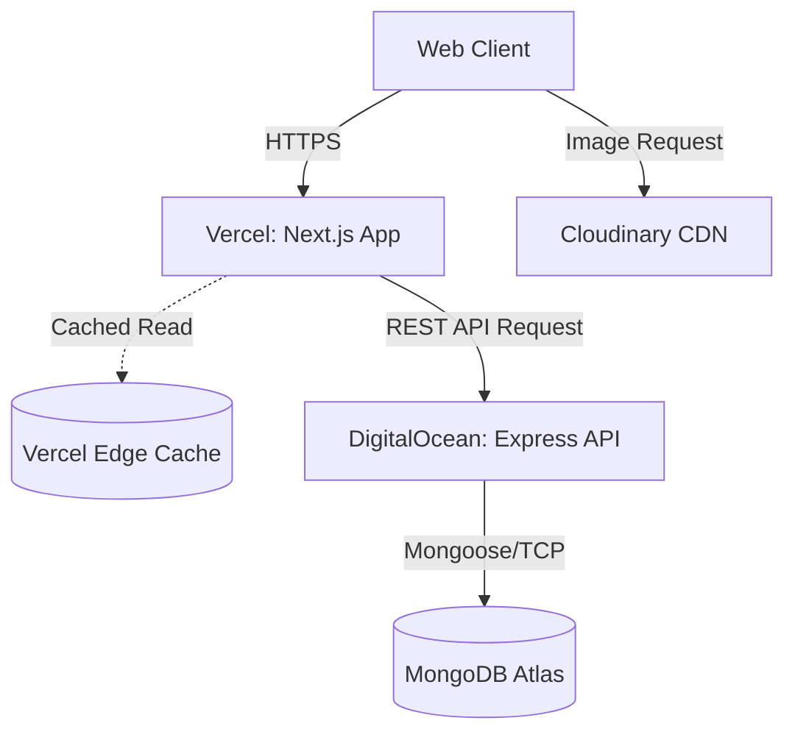

# 02 - System Architecture

## History
| Version | Date       | Author         | Changes         |
| :------ | :--------- | :------------- | :-------------- |
| 1.0.0   | 2026-08-04 | Lead Architect | Initial Draft   |

---

## 1. Purpose
This document governs the macro-level system architecture, specifically defining the network flow, deployment topologies, and latency mitigation strategies for the Intelligen Hirelinks Platform.

## 2. Scope
This document covers the interaction between the Public Website (Next.js on Vercel), the Backend API (Express on DigitalOcean), and the Database (MongoDB Atlas). It explicitly defines how data flows across these infrastructure boundaries.

## 3. Decision Summary
*   **Decoupled Infrastructure**: Frontend is hosted on Vercel (Edge/Serverless) while the Backend is hosted on DigitalOcean (Long-lived server).
*   **Next.js as Edge Cache**: Vercel acts as our primary caching layer to mitigate the network latency of querying DigitalOcean and MongoDB.
*   **Strict CORS Boundary**: The Express API will explicitly whitelist the Vercel production and preview domains.
*   **Stateless Backend**: The Express API must remain entirely stateless to allow horizontal scaling on DigitalOcean.

## 4. Architecture Decisions

### 4.1. The Network Triad (Vercel → DO → Atlas)
The platform spans three distinct infrastructures. A direct, unoptimized request flows as follows:
1.  **Client** requests page from **Vercel** (Next.js).
2.  **Vercel** Server Component makes an HTTP REST call to **DigitalOcean** (Express).
3.  **DigitalOcean** queries **MongoDB Atlas** via Mongoose.
4.  Data returns up the chain.

**The Latency Risk**: Crossing data centers adds Time to First Byte (TTFB). 
**The Mitigation**: Next.js App Router's Data Cache and Full Route Cache are mandatory. Express should only be hit for mutations (writes) or highly dynamic, personalized data (e.g., User Profile). Public content (Blogs, Services) MUST be cached at the Vercel Edge.

### 4.2. Infrastructure Responsibilities
*   **Vercel (Next.js)**: Responsible for UI presentation, SEO rendering, edge caching, and routing. Must NOT contain direct database connections.
*   **DigitalOcean (Express)**: Responsible for business logic, validation, authorization, and database orchestration. Must NOT return HTML or UI components.
*   **Cloudinary**: Responsible for all media storage, compression, and on-the-fly image transformations. Images must NEVER be processed on Vercel or stored on DigitalOcean.
*   **MongoDB Atlas**: The single source of truth for all structured data.

## 5. Design Rules

*   **Rule 5.1 (Aggressive Edge Caching)**: All GET requests from Next.js to Express fetching public data MUST utilize Next.js `fetch` caching (e.g., `next: { revalidate: 3600 }`).
*   **Rule 5.2 (Media Offloading)**: All Next.js `<Image />` components MUST use the Cloudinary loader. Vercel's built-in image optimization must be disabled to save bandwidth and compute costs.
*   **Rule 5.3 (Stateless API)**: The Express backend MUST NOT use local file system storage or memory-based sessions. All sessions must be handled via stateless JWTs.
*   **Rule 5.4 (Environment Variables)**: Infrastructure boundaries must be strictly respected. Next.js must NEVER have access to the `MONGO_URI`. Express must NEVER have access to Next.js specific secrets unless explicitly shared.

## 6. Diagrams



## 7. Examples

**Good (Cached Fetch in Next.js)**:
```typescript
// Implements 02-system-architecture.md §5 (Rule 5.1)
const res = await fetch('https://api.hirelinks.com/v1/blogs', {
  next: { revalidate: 3600 } // Cache at the Edge for 1 hour
});
```

**Bad (Bypassing Cache for Public Data)**:
```typescript
// Violates Rule 5.1
const res = await fetch('https://api.hirelinks.com/v1/blogs', {
  cache: 'no-store' // Forces a slow Vercel -> DO -> Atlas roundtrip
});
```

## 8. Future Considerations
If the Vercel -> DO -> Atlas latency becomes a bottleneck for dynamic, authenticated user data (which cannot be heavily edge-cached), we may need to introduce an in-memory cache (like Redis) on the DigitalOcean droplet to prevent MongoDB from being the bottleneck.

## 9. Approval
*   **Approved By**: 
*   **Date**: 
