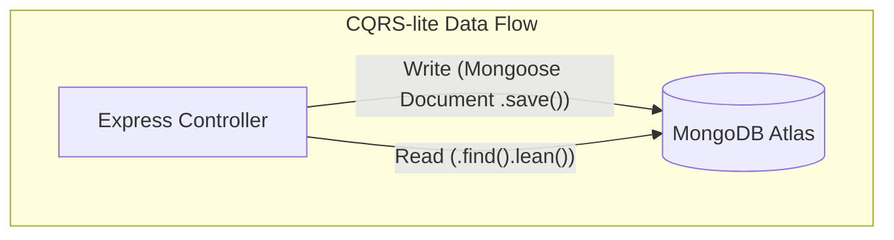

# 04 - Database Architecture

## History
| Version | Date       | Author         | Changes         |
| :------ | :--------- | :------------- | :-------------- |
| 1.0.0   | 2026-08-04 | Lead Architect | Initial Draft   |
| 1.1.0   | 2026-08-04 | Lead Architect | Added Naming Conventions, Audit Strategy, Slug/Status standards, DB Principles, SEO/Media strategy |

---

## 1. Purpose
This document governs how data is modeled, stored, retrieved, and validated using MongoDB Atlas and Mongoose within the `apps/api` Express backend. It translates the project's high-level principles (like CQRS-lite) into actionable database rules.

## 2. Scope
This document covers MongoDB NoSQL schema design patterns, relational strategies, database principles, naming conventions, and the exact execution flow of CQRS-lite operations.

## 3. Decision Summary
*   **Technology**: MongoDB Atlas accessed exclusively via the Mongoose ODM.
*   **Database Principles**: Optimize for reads, always use UTC dates, require indexing on queried fields, and enforce validation-first patterns.
*   **Soft Deletes & Auditing**: Hard deletes are forbidden for critical data. Use `deletedAt` and track `createdBy`/`updatedBy`.
*   **Media & SEO**: SEO metadata is embedded. Media is referenced via Cloudinary identifiers.
*   **CQRS-lite Execution**: Read operations (Queries) bypass Mongoose hydration using `.lean()`. Writes (Commands) use fully hydrated Mongoose Documents.

## 4. Database Principles
All database interactions and schema designs must adhere to the following principles:
*   **Read Optimization First**: A CMS is overwhelmingly read-heavy. Data must be structured to make retrieval as fast as possible, even if it makes writes slightly more complex.
*   **Universal Time (UTC)**: Every date/time stored in the database MUST be in UTC. Timezone conversions happen strictly on the client (frontend).
*   **Strict Indexing**: Collections must explicitly define indexes for any field used in sorting, filtering, or lookups. 
*   **Validation-First**: Mongoose schemas are a secondary failsafe. Zod is the primary gatekeeper for payload validation at the application edge.

## 5. Architecture Decisions

### 5.1. Relational Patterns in MongoDB
Treating MongoDB exactly like a relational SQL database (by relying heavily on `$lookup` pipelines) causes severe performance degradation.
*   **Embedding**: Use embedding for 1-to-few or strongly coupled relationships (e.g., a `User`'s array of email addresses).
*   **Referencing (ObjectIds)**: Use referencing for 1-to-many unbound relationships, or independent lifecycle management (e.g., `authorId`).
*   **Denormalization**: If a high-traffic public query requires referenced data, denormalize the essential read-only fields (e.g., storing `authorName` and `authorAvatar` directly on the `Blog` document) to eliminate the `$lookup` cost.

### 5.2. Media & SEO Persistence Strategy
*   **SEO Metadata**: Because SEO data is uniquely and permanently coupled to a specific piece of content, it MUST be embedded directly within the parent document (e.g., a `seo` subdocument on the `Blog` schema).
*   **Media Assets**: Because images/videos are managed by Cloudinary and can be reused, they are NOT embedded as binary data. Store the Cloudinary URL or `public_id` as a string or reference object within the document.

### 5.3. Soft Delete & Audit Strategy
*   **Soft Deletes**: Hard deleting (permanently removing a document) is forbidden for core content or user data. Use a `deletedAt: Date | null` field. Queries must filter out `{ deletedAt: { $ne: null } }` by default.
*   **Audit Trails**: All significant entities MUST track `createdBy` and `updatedBy` using the `ObjectId` of the user who performed the action, alongside standard Mongoose `timestamps` (`createdAt`, `updatedAt`).

### 5.4. CQRS-lite Data Flow
*   **Queries (Reads)**: Must return POJOs via `.lean()`, bypassing Mongoose hydration for maximum throughput.
*   **Commands (Writes)**: Must instantiate or modify Mongoose Documents to ensure `.save()` hooks, virtuals, and DB-level validation rules execute properly.

## 6. Design Rules

### 6.1. Database Naming Conventions
*   **Collections**: `plural_snake_case` (e.g., `blog_posts`, `user_profiles`).
*   **Fields**: `camelCase` (e.g., `createdAt`, `authorName`).
*   **Models (Classes/Types)**: `PascalCase` (e.g., `BlogPostModel`).
*   **File Names**: `[module].model.ts` (e.g., `blog.model.ts`).

### 6.2. Slug & Status Standards for Public Content
Any collection that represents public-facing content (Blogs, Services, Pages, Programs) MUST contain:
*   A `slug` field of type `String`, configured with a unique index.
*   A `status` field using a standard Enum (e.g., `DRAFT`, `PUBLISHED`, `ARCHIVED`).

### 6.3. Query Execution Rules
*   **Rule 6.3.1 (Lean Queries)**: All `find`, `findOne`, and `findById` queries intended for read-only HTTP responses MUST append `.lean()`.
*   **Rule 6.3.2 (Avoid Extreme Lookups)**: Queries MUST NOT chain more than two `$lookup` aggregations.

## 7. Diagrams



## 8. Examples

**Good (Denormalization & SEO Embedded)**:
```typescript
const BlogSchema = new Schema({
    title: String,
    slug: { type: String, unique: true }, // Slug standard
    status: { type: String, enum: ['DRAFT', 'PUBLISHED'] }, // Status standard
    authorId: { type: Schema.Types.ObjectId, ref: 'User' },
    authorName: String, // Denormalized field
    seo: { // Embedded SEO Strategy
        metaTitle: String,
        metaDescription: String
    },
    deletedAt: Date, // Soft delete standard
    createdBy: { type: Schema.Types.ObjectId, ref: 'User' }, // Audit standard
    updatedBy: { type: Schema.Types.ObjectId, ref: 'User' }
}, { timestamps: true });
```

## 9. Future Considerations
If full-text search requirements exceed standard MongoDB text index capabilities, we may integrate Atlas Search or an external search engine. CQRS-lite allows routing read queries to the search engine while writes hydrate the primary database.

## 10. Approval
*   **Approved By**: Lead Architect
*   **Date**: 2026-08-04
