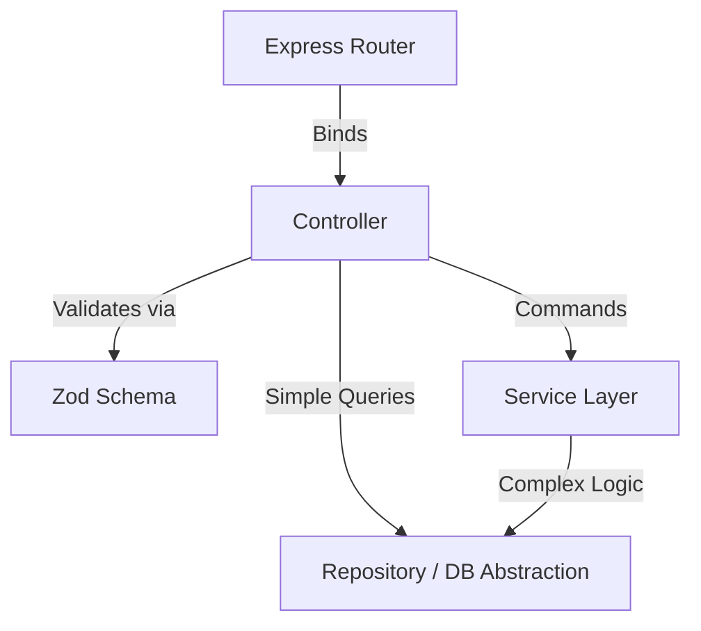
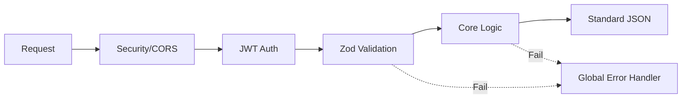

# 05 - Backend Architecture

## History
| Version | Date       | Author         | Changes         |
| :------ | :--------- | :------------- | :-------------- |
| 1.0.0   | 2026-08-04 | Lead Architect | Initial Draft   |
| 1.1.0   | 2026-08-04 | Lead Architect | Added Backend Principles, Middleware Pipeline, Flexible Anatomy, Dependency Diagram |

---

## 1. Purpose
This document defines the structural anatomy, request lifecycle, error handling, and routing standards for the Express API backend (`apps/api`). It enforces strict boundaries between controllers, services, and validation logic to guarantee predictable API behavior.

## 2. Scope
This document covers the internal anatomy of a backend module, the global error handling strategy, the standard API response format, and the flow of an HTTP request. (Note: Database interactions are governed exclusively by `04-database-architecture.md`).

## 3. Decision Summary
*   **Framework**: Express.js with TypeScript.
*   **Backend Principles**: Thin Controllers, Rich Services, Explicit Validation, Stateless API, Standard Responses, Typed Errors, Module Isolation, strict Dependency Direction, and No Circular Imports.
*   **Validation Boundary**: Zod schemas act as an impenetrable shield at the Controller layer.
*   **Global Error Handling**: `try/catch` blocks are strictly banned in individual controllers. All unhandled async rejections are caught by a global error middleware.
*   **Standard API Response**: Every endpoint returns an identical `{ success, data, error, meta }` JSON structure.

## 4. Backend Principles
Every backend module MUST adhere to the following principles:
*   **Thin Controllers**: Controllers exist only to parse HTTP, validate data, call the execution layer, and return a response.
*   **Rich Services**: Business logic, orchestrations, and domain rules live strictly in the Service layer.
*   **Explicit Validation**: Never trust incoming data. Everything is strictly validated at the boundary.
*   **Stateless API**: The backend stores no session state in memory or on disk. All auth context is passed per-request (JWT).
*   **Standard Responses**: A completely uniform JSON output for every endpoint, success or failure.
*   **Typed Errors**: Throw specific error classes (e.g., `NotFoundError`) instead of generic strings.
*   **Module Isolation**: A module is a self-contained vertical slice.
*   **Dependency Direction**: Flow must always go inward (Router -> Controller -> Service -> DB).
*   **No Circular Imports**: Two modules or classes must never depend on each other bidirectionally.

## 5. Architecture Decisions

### 5.1. Flexible Module Anatomy
A vertical slice (Module) inside `apps/api/src/modules/[moduleName]` is flexible based on its complexity, but generally consists of:
*   `[module].routes.ts`: Defines Express routes and binds middleware/Controllers.
*   `[module].controller.ts`: Parses requests, executes Zod validation, calls Services, and formats responses.
*   `[module].service.ts`: (Optional for simple reads) Contains pure business logic.
*   `[module].schema.ts`: Zod validation schemas.
*   `[module].model.ts`: Mongoose schemas.
*   `[module].repository.ts`: (Optional) Encapsulates DB logic for complex domains.

### 5.2. Layer Responsibilities
To prevent bloated code and context bleed, layers have strict boundaries:

*   **Controller**: 
    *   *Responsibilities*: Parses HTTP requests, executes Zod validation, invokes the appropriate Service (or approved read abstraction), formats standard responses.
    *   *Must Never*: Contain business logic, execute raw database queries, or make 3rd-party API calls.
*   **Service**:
    *   *Responsibilities*: Executes business logic, enforces authorization rules, triggers events, and coordinates data access.
    *   *Must Never*: Know about HTTP (no `req`/`res`), set HTTP status codes, or send network responses directly.
*   **Repository (Optional Guidance)**:
    *   *Responsibilities*: Abstract database complexity for domains with heavy Mongoose operations.
    *   *Must Never*: Enforce business rules or authorization checks.

### 5.3. Request Lifecycle & Middleware Pipeline
The flow of an HTTP request must follow this exact sequential path:
1.  **Global Middleware**: Logging, CORS, Helmet (Security Headers), Body Parsing.
2.  **Route-Specific Middleware**: Rate Limiting, JWT Authentication (sets `req.user`).
3.  **Controller (Extraction)**: Extracts `req.body`, `req.query`, `req.params`, and `req.user`.
4.  **Controller (Validation)**: Passes extracted data through Zod schemas. Throws `ValidationError` on failure.
5.  **Execution (CQRS-lite)**: 
    *   *Read*: Controller may execute simple read operations through the approved read abstraction for the module, following the CQRS-lite rules defined in the architecture.
    *   *Write*: Controller passes the strongly-typed, validated data to the Service.
6.  **Service**: Executes business logic and returns the result.
7.  **Controller (Response)**: Wraps the result in the Standard Response Format.
8.  **Global Error Middleware**: Catches any errors thrown during steps 2-7 and formats the error response.

## 6. Design Rules

*   **Rule 6.1 (Zod Boundary)**: Controllers MUST validate all incoming external data using Zod before passing it deeper.
*   **Rule 6.2 (Service Agnosticism)**: Services MUST NEVER accept Express `req` or `res` objects as parameters.
*   **Rule 6.3 (Standard Response)**: Every endpoint MUST return: `{ success: boolean, data: any | null, error: object | null, meta?: object }`.

## 7. Diagrams

### Dependency Direction

### Middleware Execution Order

## 8. Implementation Impact
During an Implementation Specification sprint, developers/AI must construct backend modules in this exact pipeline order, ensuring NO business logic creeps into the Controller, and NO Express logic creeps into the Service. 

## 9. Future Considerations
As the API scales, we may introduce explicit Data Transfer Objects (DTOs) for mapping output logic if the Models drift significantly from the desired API output shapes.

## 10. Approval
*   **Approved By**: Lead Architect
*   **Date**: 2026-08-04
