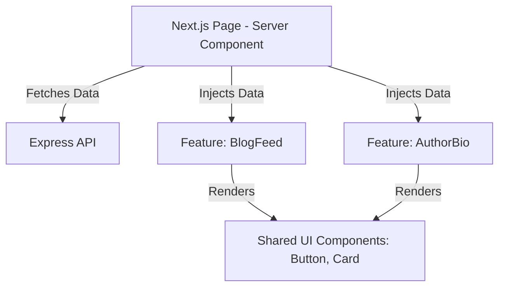

# 06 - Frontend Architecture

## History
| Version | Date       | Author         | Changes         |
| :------ | :--------- | :------------- | :-------------- |
| 1.0.0   | 2026-08-04 | Lead Architect | Initial Draft   |
| 1.1.0   | 2026-08-04 | Lead Architect | Added Forms, State, Performance, Route Groups, and Layer Architecture strategies. Refined boundaries. |

---

## 1. Purpose
This document defines the structural anatomy, rendering strategies, data fetching, and component organization for the Next.js App Router frontend (`apps/web`). It establishes strict boundaries to ensure the presentation layer remains performant, SEO-optimized, and highly maintainable.

## 2. Scope
This document covers the Next.js App Router configuration, the feature-first folder structure, server vs. client component usage, Admin panel integration, and state management patterns.

## 3. Decision Summary
*   **Framework**: Next.js App Router (React) using TypeScript.
*   **Rendering Default**: Server First, Client Only When Necessary. 
*   **Feature-First Structure**: Code is organized into Vertical Slices (`features/`) instead of global technical folders.
*   **Styling**: TailwindCSS combined with shadcn/ui.
*   **Admin Integration**: The Admin CMS lives natively within `apps/web` utilizing Route Groups to isolate layouts.
*   **Forms**: React Hook Form + Zod (using `packages/contracts`).

## 4. Frontend Principles
Every frontend feature MUST adhere to the following principles:
*   **Server-First**: Render as much HTML on the server as possible. Ship minimal JavaScript to the client.
*   **Thin Presentation**: UI Components should only display data and handle user input. Complex business rules belong in the backend API.
*   **Component Isolation**: A component should not implicitly depend on the state of a distant parent. Use composition or context where appropriate.
*   **Strict Typing**: Every prop, state, and API response MUST be strictly typed.
*   **Performance First**: Minimize client-side bundle size, leverage Next.js Edge Caching, and defer image processing to Cloudinary.

## 5. Architecture Decisions

### 5.1. Frontend Layer Architecture
The frontend follows a distinct hierarchy:
1.  **Pages (`app/`)**: Act as orchestrators. They fetch data via Server Components and inject it into Features.
2.  **Features (`src/features/`)**: Contain domain-specific logic, feature-specific components, and data hooks. 
3.  **Shared UI (`packages/ui` or `src/components/`)**: Dumb, stateless components (e.g., Buttons, Inputs) completely ignorant of business logic.

### 5.2. Route Group Strategy
To manage the distinct sections of the application without polluting the URL structure, we use Next.js Route Groups:
*   **`(public)`**: Contains the marketing site, services, and blogs. Inherits the global public layout, header, and footer.
*   **`(auth)`**: Contains login, registration, and password recovery. Inherits a minimalist layout stripped of distractions.
*   **`admin`**: Contains the CMS. Inherits a dashboard layout and is protected by strict middleware authentication checks.

### 5.3. State Management Strategy
Global state management libraries (like Redux or Zustand) are heavily discouraged. 
*   **Server State**: Managed natively by Next.js Data Cache and Server Components.
*   **URL State**: Use the URL (`?query=foo&page=2`) as the single source of truth for filtering, sorting, and pagination.
*   **Local State**: Use `useState` / `useReducer` for highly localized interactive state (e.g., an accordion opening).
*   **Form State**: Managed entirely by React Hook Form.

### 5.4. Forms Strategy (React Hook Form + Zod)
All forms must be built using **React Hook Form**. Validation is strictly handled by **Zod** resolvers. The Zod schemas must be imported directly from `packages/contracts` to ensure the frontend validation is 100% synchronized with the backend API validation.

## 6. Design Rules

*   **Rule 6.1 (RSC Default)**: A component MUST NOT use `'use client'` unless interactivity is strictly required by the DOM or React State. 
*   **Rule 6.2 (Push Interactivity Down)**: If a page requires interactivity, extract only the interactive part into a Client Component leaf, leaving the rest of the page as a Server Component.
*   **Rule 6.3 (Cross-Feature Boundaries)**: A feature should remain self-contained. Cross-feature imports are permitted only when the imported component is intentionally reusable and does not create tight coupling. If multiple features require the same UI element, consider promoting it to a shared location rather than creating hidden dependencies.
*   **Rule 6.4 (Form Contracts)**: A form MUST NOT declare its own validation rules inline. It MUST consume a Zod schema from `packages/contracts`.

## 7. Diagrams

### Frontend Layer Architecture


## 8. Examples

**Good (Forms Strategy)**:
```tsx
'use client';
import { useForm } from 'react-hook-form';
import { zodResolver } from '@hookform/resolvers/zod';
import { LoginSchema, type LoginDTO } from '@hirelinks/contracts';

export function LoginForm() {
  const form = useForm<LoginDTO>({
    resolver: zodResolver(LoginSchema) // Backend and Frontend validation match perfectly
  });
  // ...
}
```

## 9. Future Considerations
If the Admin panel requires extremely complex, multi-step wizards or heavily interdependent client-side data synchronization (e.g., live collaboration), we will evaluate introducing React Query exclusively for those highly interactive administrative routes.

## 10. Approval
*   **Approved By**: Lead Architect
*   **Date**: 2026-08-04
